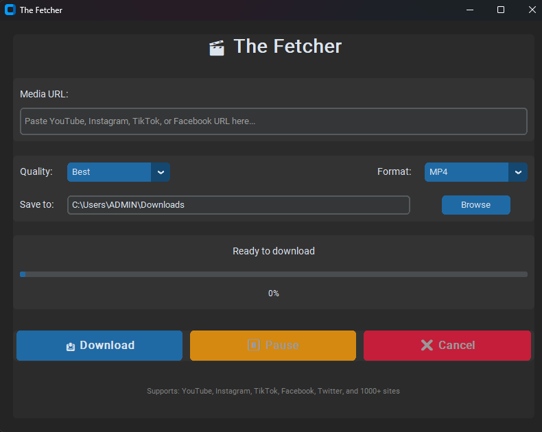

# 🎬 Multi-Platform The Fetcher

A modern, user-friendly desktop application for downloading video and audio content from YouTube, Instagram, TikTok, Facebook, and 1000+ other platforms.


## ✨ Features

- 🌐 **Multi-Platform Support** - Download from YouTube, Instagram, TikTok, Facebook, Twitter, and 1000+ websites
- 🎨 **Modern Dark UI** - Sleek, Android-inspired interface with CustomTkinter
- 📊 **Real-Time Progress** - Live download status with speed and ETA tracking
- 🎯 **Quality Selection** - Choose from Best, 1080p, 720p, 480p, 360p, or Audio Only
- 🔄 **Format Conversion** - Support for MP4, MKV, WebM, MP3, and M4A formats
- ⏸️ **Download Control** - Pause and cancel downloads anytime
- 📁 **Custom Save Location** - Choose where to save your downloaded files
- ⚡ **Fast & Efficient** - Multi-threaded downloads with responsive UI

## 📸 Screenshots


### Main Interface
```
┌─────────────────────────────────────────┐
│        🎬 The Fetcher              │
├─────────────────────────────────────────┤
│ Media URL:                              │
│ [Paste URL here........................]│
│                                         │
│ Quality: [Best ▼]  Format: [MP4 ▼]    │
│ Save to: [C:\Downloads] [Browse]       │
│                                         │
│ Ready to download                       │
│ [████████████████░░░░] 75%             │
│ Speed: 5.2 MB/s | ETA: 00:15          │
│                                         │
│ [📥 Download] [⏸ Pause] [❌ Cancel]    │
└─────────────────────────────────────────┘
```

## 🚀 Installation

### Prerequisites

1. **Python 3.7 or higher**
   ```bash
   python --version
   ```

2. **FFmpeg** (required for format conversion)
   - **Windows**: Download from [ffmpeg.org](https://ffmpeg.org/download.html)
   - **macOS**: `brew install ffmpeg`
   - **Linux**: `sudo apt install ffmpeg`

### Install Dependencies

```bash
# Clone the repository
git clone https://github.com/yourusername/media-downloader.git
cd media-downloader

# Install required Python packages
pip install customtkinter yt-dlp
```

## 💻 Usage

### Running the Application

```bash
python media_downloader.py
```

### Step-by-Step Guide

1. **Paste URL**
   - Copy the URL of the video or audio you want to download
   - Paste it into the "Media URL" field

2. **Select Quality**
   - Choose your preferred quality from the dropdown
   - Options: Best, 1080p, 720p, 480p, 360p, Audio Only

3. **Choose Format**
   - Select output format: MP4, MKV, WebM, MP3, or M4A
   - For audio extraction, select MP3 or M4A

4. **Set Save Location**
   - Default: Your Downloads folder
   - Click "Browse" to choose a different location

5. **Download**
   - Click the "📥 Download" button
   - Monitor progress in real-time
   - Use "⏸ Pause" or "❌ Cancel" if needed

## 🛠️ Configuration

### Quality Options

| Option | Description |
|--------|-------------|
| Best | Highest quality available (video + audio) |
| 1080p | Full HD quality |
| 720p | HD quality |
| 480p | Standard quality |
| 360p | Low quality (smaller file size) |
| Audio Only | Extract audio only |

### Supported Formats

**Video Formats:**
- MP4 (recommended for compatibility)
- MKV (high quality container)
- WebM (web-optimized)

**Audio Formats:**
- MP3 (universal compatibility)
- M4A (better quality at same bitrate)

## 🌍 Supported Platforms

The application supports 1000+ websites including:

- **Video Platforms**: YouTube, Vimeo, Dailymotion
- **Social Media**: Instagram, TikTok, Facebook, Twitter, Reddit
- **Live Streaming**: Twitch, YouTube Live
- **Educational**: Coursera, Khan Academy, Udemy
- **And many more!**

For a complete list, visit: [yt-dlp supported sites](https://github.com/yt-dlp/yt-dlp/blob/master/supportedsites.md)

## 📋 System Requirements

### Minimum Requirements
- **OS**: Windows 7+, macOS 10.12+, or Linux
- **Python**: 3.7 or higher
- **RAM**: 2 GB
- **Storage**: 100 MB (plus space for downloads)
- **Internet**: Active connection required

### Recommended Requirements
- **OS**: Windows 10+, macOS 11+, or Ubuntu 20.04+
- **Python**: 3.9 or higher
- **RAM**: 4 GB or more
- **Storage**: 500 MB+ free space
- **Internet**: Broadband connection (5 Mbps+)

## 🔧 Troubleshooting

### Common Issues

**Issue: "FFmpeg not found"**
```
Solution: Install FFmpeg and add it to your system PATH
- Windows: Add FFmpeg bin folder to Environment Variables
- macOS/Linux: Install via package manager
```

**Issue: "Download failed" error**
```
Solution: 
1. Check your internet connection
2. Verify the URL is valid and accessible
3. Try a different quality/format option
4. Update yt-dlp: pip install --upgrade yt-dlp
```

**Issue: UI appears blurry or pixelated**
```
Solution: Update CustomTkinter
pip install --upgrade customtkinter
```

**Issue: Slow download speeds**
```
Solution:
1. Check your internet speed
2. Try downloading at a different time
3. Some platforms may throttle download speeds
```

## 🤝 Contributing

Contributions are welcome! Here's how you can help:

1. **Fork the repository**
2. **Create a feature branch**
   ```bash
   git checkout -b feature/AmazingFeature
   ```
3. **Commit your changes**
   ```bash
   git commit -m 'Add some AmazingFeature'
   ```
4. **Push to the branch**
   ```bash
   git push origin feature/AmazingFeature
   ```
5. **Open a Pull Request**

### Development Guidelines

- Follow PEP 8 style guidelines
- Add comments for complex logic
- Test thoroughly before submitting
- Update documentation as needed

## 📝 License

This project is licensed under the MIT License - see the [LICENSE](LICENSE) file for details.

## ⚠️ Disclaimer

This tool is for personal use only. Please respect copyright laws and terms of service of the platforms you download from. The developers are not responsible for any misuse of this software.

**Important Notes:**
- Only download content you have permission to download
- Respect intellectual property rights
- Follow the terms of service of each platform
- Do not use for commercial purposes without proper authorization

## 🙏 Acknowledgments

- **[yt-dlp](https://github.com/yt-dlp/yt-dlp)** - Powerful download engine
- **[CustomTkinter](https://github.com/TomSchimansky/CustomTkinter)** - Modern UI framework
- **[FFmpeg](https://ffmpeg.org/)** - Media processing toolkit
- All contributors and supporters of this project

## 🔮 Future Enhancements

- [ ] Batch download support
- [ ] Playlist and channel downloading
- [ ] Subtitle download and embedding
- [ ] Download scheduler
- [ ] Browser extension integration
- [ ] Cloud storage integration
- [ ] Download history and management
- [ ] Multiple language support

## 📊 Project Status


**Current Version**: 1.0.0  
**Last Updated**: December 2025

---

**Made by [@Nasa,py](https://github.com/Nasa-py)**

⭐ Star this repository if you find it helpful!